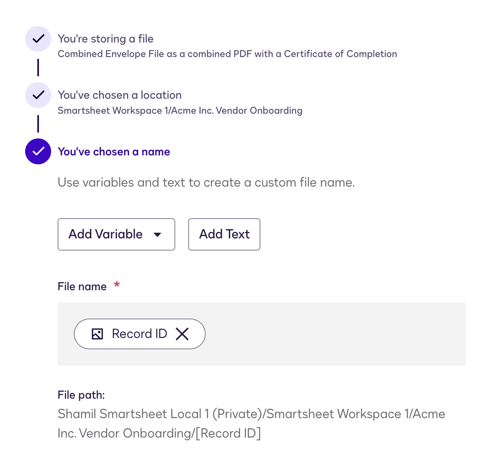

# Smartsheet Integration with Docusign

## How to Install and Configure

Installing Smartsheet App to Docusign Maestro.  
`For more detailed instructions, please follow the` [Docusign guide](https://support.Docusign.com/s/document-item?language=en_US&bundleId=ous1698169987748&topicId=ctg1698170340729.html&_LANG=enus)

---

**Step 1.** Go to [Docusign App Center](https://apps-d.Docusign.com/app-center/extensionapps)  

**Step 2.** Make sure you have **Admin rights** to install the Smartsheet app from the Docusign App Center.  

**Step 3.** Find the app and click on **“Install App”**, then click **“Continue”**.  

**Step 4.** Once the app is installed, you’ll be prompted to connect the app to your Smartsheet workspace. Select **Private** or **Shared** connection type, as well as the name of the connection.  
  
  

**Step 5.** Continue by clicking the **“Login”** button, then you will be prompted to grant Docusign access to your Smartsheet account. Make sure you are logged in to your Smartsheet already.  

If connected successfully, you can go to [Docusign App Manager](https://apps-d.Docusign.com/app-center/manage) and manage your app if needed. To manage connections or uninstall the app, press the three dots next to the app name.  

---

## How to Use the App

The Smartsheet extension makes it easy to **send, track, and attach signed documents** within a Maestro workflow. After installation, new Smartsheet options appear in the Workflow Builder.

Start by creating a workflow and selecting a Smartsheet action to connect your account and manage eSignatures directly from Smartsheet.

You can start by creating a new workflow by following [this Docusign link](https://apps-d.Docusign.com/send/workflows) or navigating to **Agreements → Maestro Workflows → Create Workflow**.

---

### Available Smartsheet Actions in Workflows

When adding a new step, you’ll see three Smartsheet options:

- **File Write to Smartsheet** – store documents as Smartsheet row attachments.  
- **Writeback to Smartsheet** – update or create new data directly in your Smartsheet workspace.  
- **Read from Smartsheet** – retrieve row data (such as IDs or values) for use in other steps.  

---

## Configuring “Read” from Smartsheet

**Steps:**

1. Once a step is added from Workflow, press **Configure** to continue.  
2. Give your step a **name**.  
3. Choose a **connection** (created when you linked your Smartsheet account).  

Select the **Smartsheet object** (workspace items such as sheets or projects), then press **Next**.  

- Select your Smartsheet fields that you would like to use in this workflow. You will later be able to map these field to other steps.  
  

- **Important:** In order to let the app know which row to pull the data from, you need to be able to **identify** it. If this is the first data inflow in your workflow, we would suggest creating a column in Smartsheet which would hold the identification value, such as "Use this row" or "Not Started". As a following step you will be able to update that cell using a Writeback function to change it's value to "Started" or "In progress" to make sure it's not used by future instances of the workflow. In the following steps, now that the app knows which row to use, you can use one of the unique values to map back to this row.

✅ After clicking **Apply**, the “Read” step is successfully added. You can now use retrieved Smartsheet data in the following steps.

---

## Configuring “Write” to Smartsheet

1. Select **“Writeback to Smartsheet”** from the app options.  
   

2. Select your **connections** and Smartsheet object.  
   

3. Choose **Write settings**:  
   - **Update** → modifies an existing value.  
   - **Create** → adds a row with a new value.  

> Example: If updating a contract status - use **Update**. If adding a new row with a given value - use **Create**.  

4. Select the fields you want to write to (these are Smartsheet **columns**).  
5. Map Docusign fields to Smartsheet fields.  
     
   

6. Set **mapping criteria** to identify the row and click confirm.  
   

✅ Press **Apply** and continue with the next Maestro steps.

---

## Configuring `File Write` to Smartsheet

> **Important:**
> If you see "No files available" when configuring this step, it means previous Maestro steps did not generate any files.

### Steps

1. **Select the file** you want to attach to Smartsheet.  
   

2. **Select drive** - you can choose anything  
   **Select folder** select a table that holds a row you need to add the file to  

   

3. **Specify a file name**

   It is to define the row identifier the file will be attached to

   - Use variable to create a custom file name
   - Click `Add Variable` to insert data from previous steps returning Record ID. It can be any Read or Create step.

   

**How File Attachment Works:**

The app attempts to attach files in the following order:

1. **Row-level attachment** (preferred): The app extracts the row identifier from the filename (everything before the file extension) and attempts to attach the file directly to that specific row using the Primary Column value.

2. **Sheet-level attachment** (fallback): If the row cannot be found or the row attachment fails, the file is attached at the sheet level instead. You'll receive a message indicating: `"Row {identifier} not found in table '{sheet-name}', file was attached to the table instead"`

---

## How to Reconnect the App

You will be required to reconnect Smartsheet to Docusign Maestro if there have been updates made to the structure of the sheets you use (new columns added, or current column type/names changed).

**Steps:**

1. Log in to your **Docusign account** with administrator credentials.  
2. In a new browser tab, go to the appropriate environment:  
   - [Production](https://apps.Docusign.com/app-center)  
   - [Demo](https://apps-d.Docusign.com/app-center)  
3. Select the **Smartsheet icon** and click **Manage Connections**. You will see a screen that allows you to "**Reconnect**".

---

# FAQs

**I updated my Smartsheet workspace. Do I need to reconnect?**  
> Yes. Go to *Installed Apps → Manage Connections → Reconnect*. This refreshes the data and updates workflow mappings.  

**How do I ensure the signed envelope is saved to the correct row?**  
> In v1.0, include the **Primary column value** as the file name. This ensures it maps correctly.  

**How does the app know which row data to use?**  
> Add a dedicated trigger/status column (e.g. “Next for Docusign”). Have the app **Read** that row. Then in the next workflow step, use **Writeback** to change it to “In progress” to prevent duplicates.  
